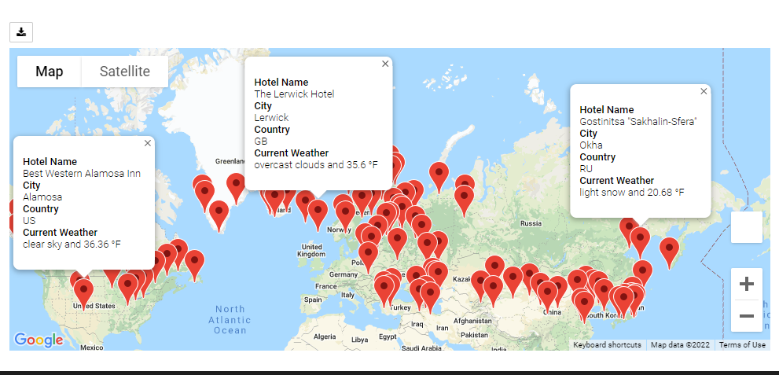

# Travel Planner Based on Weather

## Overview

Within this analysis, there is code segregated into separate folders which execute the following:

**Weather_Database Folder**
1. Generates a set of 2,000 random latitudes and longitudes.  
2. Retrieves the nearest city using CitiPy API.
3. Performs an API call to OpenWeatherMap to gather details about the city including max temperature and current weather.
4. A new DataFrame is created containing weather data.
5. Creates file WeatherPy_Database.csv with an example stored within this directory.  This file is used in the following code in the Vacation_Search folder.

**Vacation_Search Folder**
1. The user is prompted to enter Min/Max Temperatures to find cities where the max temperature is within the user's parameters.
2. Uses parameters inputted to identify potential travel destinations and nearby hotels using Google Maps Nearby Search API "https://maps.googleapis.com/maps/api/place/nearbysearch/json". 
3. Creates a Google Map (gmaps API) with a hotel recommendation at each pop-up location markers (Fig 1).
4. Generates file WeatherPy_vacation.csv which will be used in the Vacation_Itinerary section.

*Fig 1 - Example of output based on user inputs*

**Vacation_Itinerary Folder**

1. Creates a travel itinerary based on 4 locations.  
2. Uses the Google Directions API to show a route between four cities chosen from the customer’s possible travel destinations (Fig 2).
3. Create a marker layer map with a pop-up marker for each city on the itinerary (Fig 3).

*Fig 2 - Route Map*

*Fig 3 - Recommended Hotels for Route*

